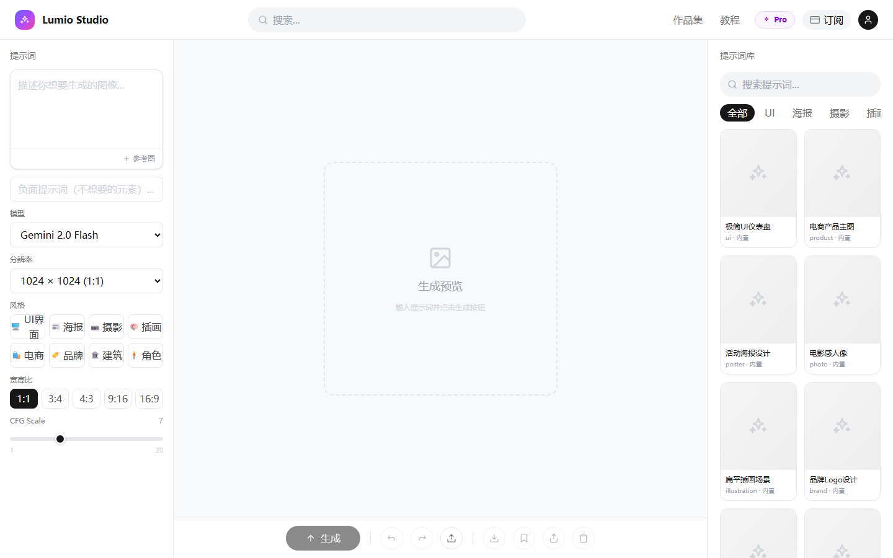
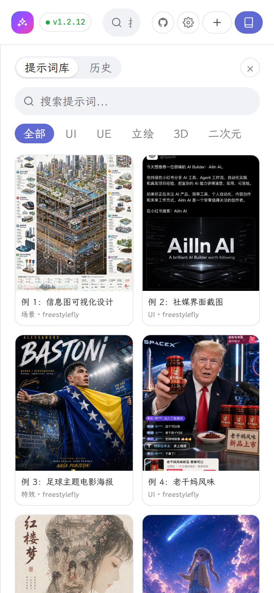

# Image Studio

A conversational AI image-generation workspace built with React + TypeScript + Vite, working with any OpenAI-compatible image API.

中文文档：[`README_zh.md`](./README_zh.md)

## Screenshots

Desktop:



Mobile:

<p align="center">
  
</p>

## Star History

[](https://www.star-history.com/#SummerSec/Gen-Image&Date)

## Features

- **Conversational workspace**: a chat thread in the center, a composer at the bottom, and a collapsible right panel (prompt library / history).
- **Prompt library**: two upstream repos wired in as submodules; thumbnails localized to `public/prompt-thumbs/**`. Clicking a card fills the prompt and sets it as a reference image.
- **Reference images**: multi-select upload, clipboard paste, drag-and-drop; turn any result into a reference; click to enlarge. References are consumed (cleared) after each send.
- **Multi-image generation**: 1–4 images per request.
- **Inpainting**: built-in mask editor to repaint a brushed region from a prompt.
- **Generation timer**: shows elapsed seconds while generating.
- **History**: persisted in the browser's IndexedDB; clearable from settings.
- **Multiple API profiles**: save several Base URL / model / key sets and switch anytime.
- **API mode**: choose Images API (`/v1/images`) or Responses API (`/v1/responses` + image_generation tool).
- **base64 toggle**: optionally append `response_format: b64_json` to the request body.
- **CORS proxy**: optional, to work around browser cross-origin limits.
- **Image watermark**: on by default (`gen-img.sumsec.me`, bottom-right); only an admin can disable it.
- **Light Linear-style UI**, body font is LXGW WenKai (霞鹜文楷).
- All settings persisted in browser `localStorage`.

## Tech Stack

- React 19
- TypeScript
- Vite
- Tailwind CSS 4
- Zustand
- OpenAI JS SDK

## Requirements

- Node.js 20+ recommended
- Git (for submodules)
- (Optional) GitHub CLI

## Quick Start

```bash
npm install
powershell -ExecutionPolicy Bypass -File scripts/setup-prompt-submodules.ps1
npm run sync:prompts
npm run dev
```

Open the URL printed by Vite (default `http://localhost:5173`).

On first run, set the Base URL, model ID, and API Key in **Settings → API**.

## Environment Variables

- `VITE_ADMIN_PASSWORD`: admin password. Enter it in Settings → Options to unlock disabling the image watermark. When unset, the watermark stays on and cannot be turned off.

## Available Scripts

- `npm run dev` - start dev server
- `npm run build` - type-check + production build
- `npm run preview` - preview production build
- `npm run lint` - run ESLint
- `npm run sync:prompts` - regenerate prompt data from submodules
- `npm run sync:prompts:update` - update submodules then regenerate prompt data

## Prompt Sync Workflow

Prompt sync script: `scripts/sync-prompts.mjs`

### Data Sources

- `EvoLinkAI`: extracts only Simplified Chinese cases from `cases/*_zh-CN.md`
- `freestylefly`: extracts case prompts from `docs/gallery-part-1.md` and `docs/gallery-part-2.md`

### Thumbnail Strategy

- Images are copied from submodules to local public assets:
  - `public/prompt-thumbs/evolink/**`
  - `public/prompt-thumbs/freestylefly/**`
- Namespaces are isolated to avoid collisions.
- Generated prompt data references local paths only.

## Project Structure

```text
src/
  components/
    chat/        conversation thread + composer
    layout/      topbar, right panel
    canvas/      mask editor (inpainting)
    settings/    settings modal
  data/
    prompts.ts
    prompts.manual.ts
    prompts.generated.ts
  services/      api.ts, idb.ts, watermark.ts
  store/         Zustand state
scripts/
  setup-prompt-submodules.ps1
  sync-prompts.mjs
external/
  awesome-gpt-image-2
  awesome-gpt-image-2-api-prompts
public/
  prompt-thumbs/
```

## Notes

- `src/data/prompts.generated.ts` is auto-generated. Do not edit manually.
- If submodules are unavailable, the app falls back to `prompts.manual.ts`.
- If prompt thumbnails fail to show, run `npm run sync:prompts`.

## Friendship Link

Thanks for the support and feedback from the friends at [LINUX DO](https://linux.do/).
